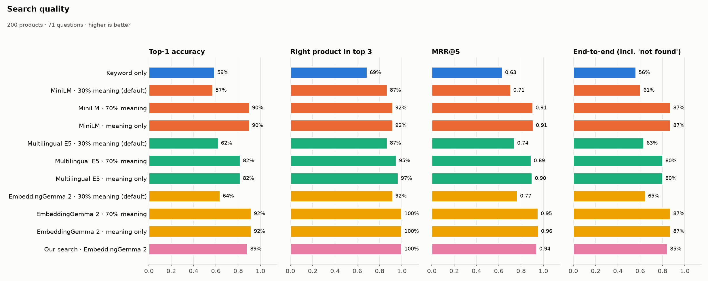

# EmbeddingGemma vs Typesense: search for a Kenyan shop

I wanted to know whether Google's new **EmbeddingGemma 2** is worth using for product search, compared
with what **Typesense** already gives you. So I built a fake Kenyan electronics shop (200 products,
prices in KES) and asked every setup the same 71 questions, in English, Swahili and Sheng.

Four ways of searching were compared:

1. **Typesense, word matching only** (no AI)
2. **Typesense + its own built-in AI models** (MiniLM, multilingual E5)
3. **Typesense + EmbeddingGemma 2**
4. **EmbeddingGemma 2 on its own** (a small Python search, no Typesense)



## What I found

| Setup | Right product first | Swahili/Sheng (8 questions) | Time per search | Memory |
|---|---|---|---|---|
| Typesense, words only | 59% | 1 of 8 | 0.001 s | 7 MB |
| Typesense + small built-in AI (MiniLM) | 90% | 3 of 8 | 0.007 s | ~190 MB |
| Typesense + multilingual built-in AI (E5) | 82% | 4 of 8 | 0.008 s | ~590 MB |
| **Typesense + EmbeddingGemma** | **92%** | **5 of 8** | 0.17 s | ~970 MB |
| EmbeddingGemma alone | 89% | 5 of 8 | 0.16 s | ~970 MB |

*AI rows use the "trust the AI 70%" setting explained below. Laptop CPU, no graphics card.*

**1. One Typesense setting matters more than the model.** Typesense mixes two opinions: word
matching and the AI. By default it trusts word matching 70% and the AI only 30%, so turning on an AI
model barely helps (about 60% right, the same as words only). Ask for "how much is the iphone 15" and
the default hands you an *iPhone 15 wallet case*. Flip it to trust the AI 70% and every model jumps to
82–92%.

**2. EmbeddingGemma gave the best answers, but only just.** 92% against 90% for Typesense's tiny
built-in model is one question out of 71, and the small model is about 25× faster and uses a fifth
of the memory.

**3. Swahili is still unreliable for every model.** EmbeddingGemma got 5 of 8. The small model
answered "chaja ya simu ya gari" (car phone charger) with a drone, and EmbeddingGemma answered
"simu rahisi ya M-Pesa kwa bibi yangu" (a simple M-Pesa phone for my grandma) with a MiFi.

**4. "We don't sell that" is hard.** Word search always returns *something* ("book a hotel in
Mombasa" → a Kindle). The AI models say no more often, but get fooled by things that sound related:
"men's running shoes" → running headphones.

**5. Mind the cost.** EmbeddingGemma is a 1.5 GB download, uses about 1 GB of memory and took 33 s to
prepare 200 products on my laptop. At 10,000+ products you would want a GPU.

**About the size.** EmbeddingGemma 2 handles text, images, video and audio (740M parameters in total),
but text search only needs its 270M-parameter text part. Google quotes ~191 MB of RAM for that part,
*quantized on a phone*. This test runs it unquantized on a laptop CPU. I checked loading text only
against loading everything: the embeddings are identical (so the accuracy results don't change), and
on this laptop it barely saves anything (peak memory ~935 MB vs ~970 MB, ~0.14 s per search either way),
because the unused image and audio parts were never really loaded. The code now loads text only.

This is a small test, so treat it as a signal, not proof. More charts: [by question type](results/by_type.png),
[speed](results/speed.png), [cost per model](results/cost.png). Every answer from every setup is in
[results/results.json](results/results.json).

## Try it

You need Python 3.11, Node 20+ and Docker.

```bash
python3 -m venv .venv && source .venv/bin/activate
pip install torch torchvision --index-url https://download.pytorch.org/whl/cpu   # CPU build, ~200 MB
pip install -r requirements.txt

docker compose up -d                          # Typesense on port 8108
uvicorn shop.api:app --port 8000              # the API (downloads EmbeddingGemma, ~1.5 GB, on first run)
cd frontend && npm install && npm run dev     # the app at http://localhost:5173
```

The app has two pages:

- **Shop search**: ask for a product in your own words and get an answer with its price in KES.
- **Compare setups**: ask one question and see what every setup returns, side by side. Benchmark
  questions are offered as suggestions, with the correct products ticked.

## Run the benchmark yourself

```bash
python -m eval.run       # asks all 71 questions to all 11 setups -> results/results.json
python -m eval.memory    # memory per model, each in a fresh process -> results/memory.json
python -m eval.plots     # the charts in results/
```

The 11 setups are word-only search, each AI model at three settings (trust the AI 30% — Typesense's
default — 70%, or AI only), and EmbeddingGemma on its own. The questions are in
[data/eval_questions.json](data/eval_questions.json): exact product names, look-alike names
(iPhone 15 vs 15 Pro vs an iPhone 15 case), vague needs ("wifi goes off whenever KPLC cuts power"),
typos, Swahili/Sheng, and things the shop doesn't sell.

## What's where

```
data/              the catalog (build_catalog.py -> products.json) and the 71 questions
shop/search.py     EmbeddingGemma-only search
shop/api.py        the API: /api/search (shop page) and /api/compare (compare page)
eval/              the benchmark: setups.py lists every setup; run.py, memory.py, plots.py
frontend/          React app in the Msodoki theme
results/           benchmark results and charts
examples/          a 4-sentence similarity demo ("bank" as money vs river)
```

---

Built by Msodoki (Ian Muchesia).
